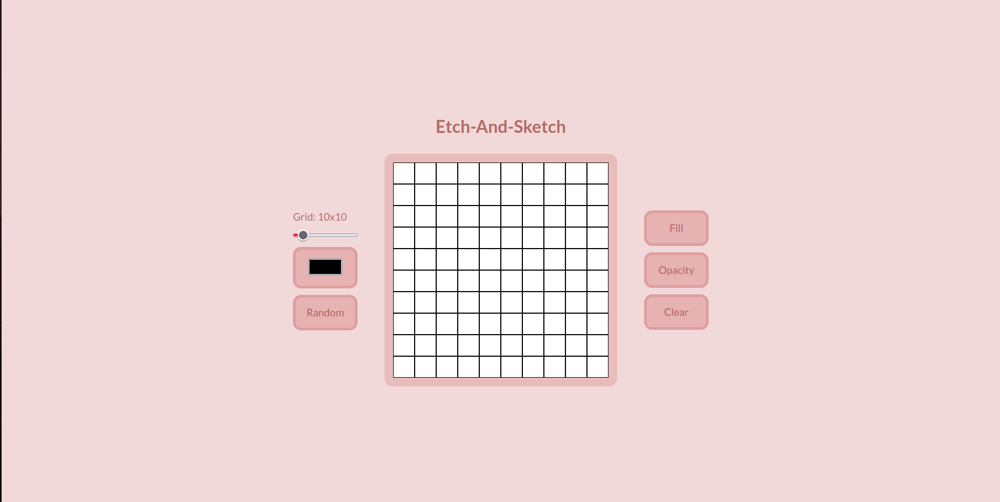

# Etch-a-Sketch
This is an Etch-a-Sketch project which you can paint on a field with certain amount of cells.

**Link to project:** https://defalterxd.github.io/Etch-a-Sketch/

## How It's Made:

**Tech used:** HTML, CSS, JavaScript

This project started with an initial phase on setting up the page:

<ol>
  <li>Adding a field and buttons for interaction on that field.</li>
  <li>Link CSS and JavaScript to HTML..</li>
  <li>Align the layout relative to each other.</li>
</ol>

Then on the second phase was building up the interaction with the functionality itself:

<ul>
  <li>I added the generation of the grid with the calculation from his container (width, height).</li>
  <li>Checked for repeated or existent cells on that grid field so it could resize on the input's thumb.</li>
  <li>And append the text to tell which size the field is currently on.</li>
</ul>

Then after setting up field generation, it was time for adding interaction to paint on:

<ul>
  <li>The picked color from the button where you just picked a color and painted with the 'mouseover' event</li>
  <li>The random color after pressing it is just generating a random color through the hexGenerator function and applying it to individual cells.</li>
  <li>The fill color is just filling out the entire field of specific color, which was from the picked color.</li>
  <li>The opacity influences the opacity of the picked color on cells.</li>
  <li>And lastly, the clear button just clears out the entire field to the default color.</li>
</ul>

After all the added functionality and interactions, all that was left to do was style up the page, and that's for all.

## Optimization:

There were some tweaks with event listeners and removing them after pressing the various buttons, like after pressing the random button and then pressing the fill button so it would interfere and apply the color, which was from random instead of the picked one. And that was the same for all buttons. So I added in each event listeners corresponding remove listeners from previous buttons and 'mouseover' events that apply those changes. That it wouldn't interfere with each other.

## Lesson Learned:

After this project I was able to:
<ul>
    <li>Use attribute for selecting in js.</li>
    <li>How to generate a field of cells into container.</li>
    <li>Use various input types to manipulating with.</li>
    <li>Remove other event listeners so it couldn't interfere while new one is listening.</li>
    <li>Make paint interactions on the field.</li>
    <li>Applying use of function expressions for more cleaner and readable code.</li>
</ul>
